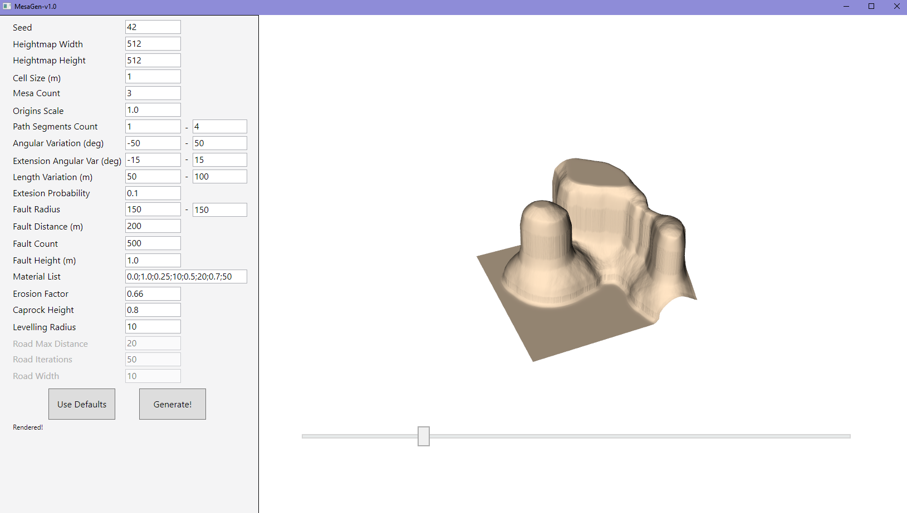
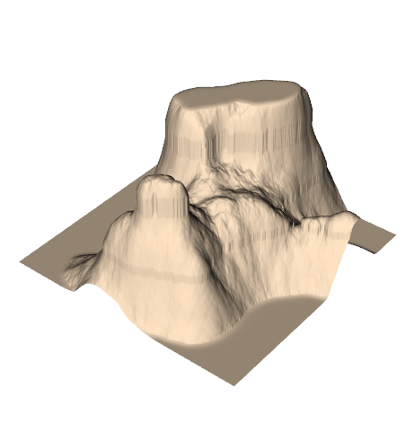
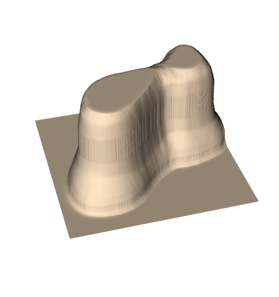
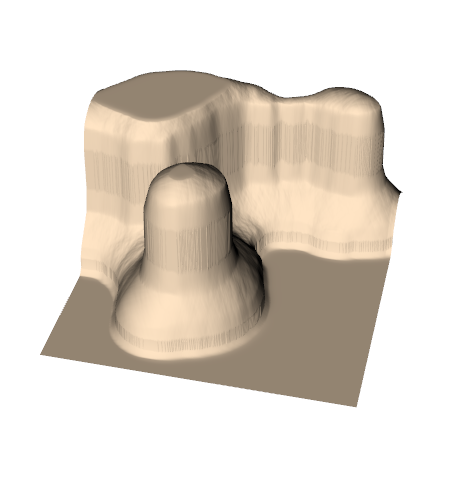
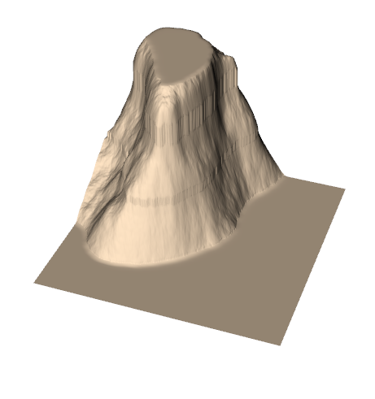

# MesaGen

 

<table align="center">
 <tr>
  <td>
   

     
   

  </td>
  <td>
   

     
   

  </td>
  <td>
   

     
   

  </td>
  <td>
   

     
   

  </td>
 </tr>
</table>

MesaGen is a procedural generator of mesa landscape features. The program was implemented by Schoenmakers, F. (Freek) and I as part of the *AI For Game Technology*. The implementation followed a research paper (which is currently unavailable online), which was extended with new control parameters and a GUI, for easier use. The system has two main components:

- multiple "mesa agents" that generate a single mesa each, permitting for parallelization
- a single "landscape agent" that applies landscape-wide processing such as simulated erosion

## The mesa agent

The mesa agent is tasked with creating a single mesa on the landscape, which is represented by a 2D height map with values set to 1. The mesa has an XY location and scale, and use the landscape width and height to to define the overall shape. To generate the landscape feature, the agent first generates a random path which the mesa will follow. Controls for the path can be the number of (minimum) path segments, angle difference between segments, chance to create an orthogonal segment, the angle variation of the orthogonal segment, and length of path segments.

Next, the agent has to overlay a set of "faults", which are circular, vertical extrusions of the terrain. The agent is tasked with overlaying a set number of faults along the whole path, in a balanced way that permits some randomness. The faults vary in size and location from the path, which makes the terrain more organic. This data is applied to an existing height map.

## The landscape agent

So far, the terrain will have rough edges around the faults, and the mesas will not look flat in the top as one would expect. The landscape agent is tasked with correcting this by processing the height map in stages. First, the agent normalizes the height map to be between 0 and 1, meaning there is always a highest touching point. Next, material layers are generated that define how soft the mesas are at each height point. This will be used later. Finally, a hardness layer is specified which defines the "ground" on which the mesa resides.

Next, the agent starts gradating the landscape to simulate erosion and smooth the edges of the faults, as well as to simulate the rubble at the bottom of mesas. This is done using circular kernels which smooth the geometry based on the distance of height map values from the kernel center. The smoothing strength can be controlled. Finally, the geometry is leveled at the too, to produce the flat caps at the top of the mesas.
